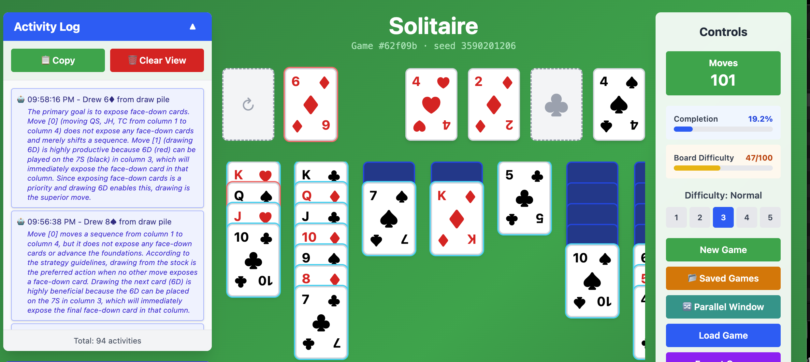
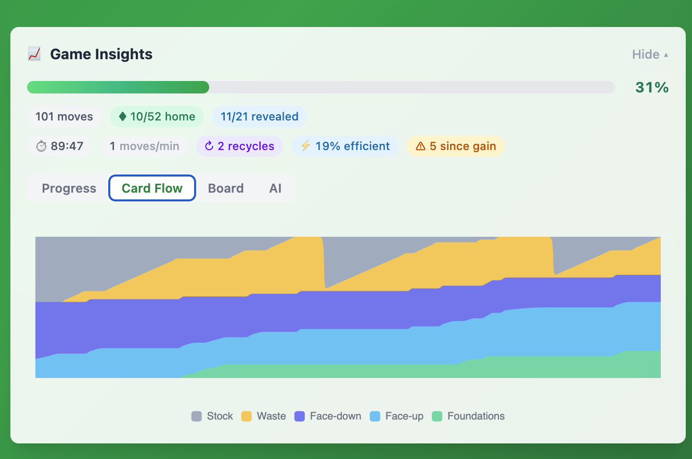

# Solitaire

Klondike Solitaire built with React and TypeScript. The repository is a pnpm
monorepo: the game logic lives in standalone libraries and the web app
consumes them.

Live: https://chayuto.github.io/Solitaire/



## Features

- Classic Klondike Solitaire with click-to-move and drag-and-drop
- Five difficulty levels and deterministic seeded deals
- Move history, replay, save and load, and game state export
- Heuristic auto-play and end-game auto-complete
- AI Move Advisor: ask an LLM for the next best move, or let it auto-play the
  whole game, with each decision explained in the activity log
- Live Game Insights dashboard — progress, card flow, move mix, and AI telemetry
  that update on every move

## Monorepo layout

| Package | Description |
| --- | --- |
| `packages/core` | `@chayuto/solitaire-core`: framework-agnostic game engine, rules, and scoring. No runtime dependencies. |
| `packages/mcts` | `@chayuto/solitaire-mcts`: Monte Carlo Tree Search solver. Depends on core. |
| `packages/app` | React application that consumes both libraries. |

## Requirements

- Node 24 or newer
- pnpm 11 or newer

## Getting started

```bash
pnpm install
pnpm run build:libs   # build core and mcts (required before the first app run)
pnpm run dev          # start the app on http://localhost:5173
```

## Scripts

| Command | Purpose |
| --- | --- |
| `pnpm run dev` | Start the app dev server |
| `pnpm run build` | Production build of the app |
| `pnpm run build:libs` | Build the core and mcts libraries |
| `pnpm run lint` | Run ESLint |
| `pnpm run test:run` | Run app unit tests once (Vitest) |
| `pnpm run test:libs` | Run library unit tests |
| `pnpm run test:e2e` | Run end-to-end tests (Playwright) |
| `pnpm run typecheck` | Type-check every package |

## Game Insights

A live dashboard that turns each move into a readable picture of the game — the
"fish bowl" effect. It updates on every move, so it is especially fun to watch
while the AI auto-plays.



- **Always-visible header** — a live progress bar plus chips for moves played,
  cards sent home (`x/52`), and face-down cards revealed (`x/21`).
- **Box-score strip** — elapsed time, move pace, stock recycles, move efficiency
  (the share of moves that revealed a card or banked one home), and a
  "stuck-o-meter" counting moves since the last gain.
- **Progress tab** — move number versus progress %, with the blended progress
  score and the foundations-home percentage as gradient area lines.
- **Card Flow tab** — a streamgraph of all 52 cards flowing from the stock
  through the waste and tableau and pooling into the foundations.
- **Move Mix tab** — how moves were spent (draws, reveals, foundation banks,
  tableau shuffles, waste plays) plus a "back-and-forth" callout for redundant
  tableau round-trips, broken out by how many the AI made.
- **AI tab** — live model telemetry: think time, token burn, self-rated
  confidence, and the success / error / resigned tally.

Charts are canvas-rendered with [ECharts](https://echarts.apache.org/) and read
a deferred copy of the history, so the dashboard stays smooth even during a fast
AI auto-play.

## AI Move Advisor

The app can ask an LLM for the next best move. It sends the visible board and a
list of legal moves; the model returns a chosen move and a reason, which is
applied and recorded in the activity log. AI Auto-Play runs the model move by
move until the game ends or a repeated position is detected.

- Provide your own API key in the in-app key dialog. It is stored in
  `sessionStorage` for the browser tab session only and is sent only to the
  provider.
- For local development, a `GEMINI_API_KEY` in a repo-root `.env` file is used
  automatically (see `.env.example`). It is never included in a production
  build.
- The default provider is Google Gemini and the default model is
  `gemma-4-31b-it`. Other Gemini and Gemma models can be selected.

## Testing

Unit tests run with Vitest and end-to-end tests with Playwright. The app is
instrumented for deterministic UI testing:

- Seeded deals via the `?seed=N` query parameter, with optional
  `&difficulty=1..5`, reproduce an identical game every run.
- A typed `window.__solitaire` bridge introspects and drives the game without
  simulating pointer input.
- Every card, pile, and control carries a `data-testid`.

## Deployment

Pushes to `main` are built and deployed to GitHub Pages by the deploy workflow.

## License

Private project.
