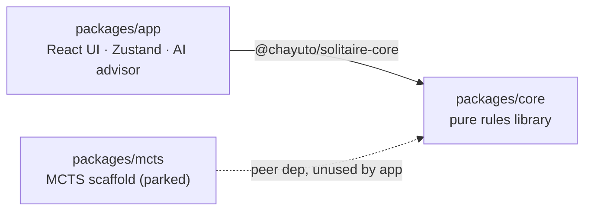
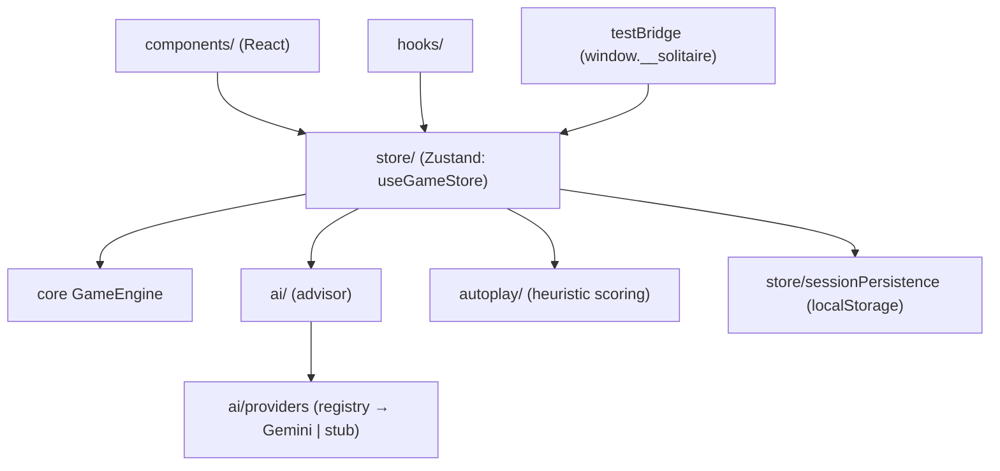

# Architecture

Klondike Solitaire as a pnpm monorepo: a pure rules library, a React app, and a parked
solver scaffold. This document describes the target architecture being landed by the
2026-06-10 refactor ([plan](./plans/20260610_maintainability_plan.md)); sections note
where the code is mid-migration.

## Packages

- **core** — immutable types (`Card`, `GameState`, `Move`, `MoveCommand`), deck/card
  utils, rules (tableau/foundation/stock), scoring, hashing, and `GameEngine`:
  `initialize`, `applyMove`, `canApplyMove`, `getLegalMoves`, `isWon/isLost`.
  Pure functions, zero dependencies, ESM+CJS build via Vite.
- **app** — everything user-facing. Consumes core via the workspace package (resolved
  through `dist/`, hence the `build:libs` build-order rule).
- **mcts** — `MCTSNode` + `GamePolicy` interface with tests; no consumer yet. Excluded
  from `build:libs`, still tested in CI so it does not rot.

## App module map

Dependency rules (lint-enforced, see ADR-0005 and `docs/adr/`):

1. **Board mutations flow through `GameEngine.applyMove`.** The store builds a
   `MoveCommand`, the engine returns the next board, the store records history and
   derived state (`completionProgress`, `gameWon`). The store never re-implements rules.
2. **`ai/` never imports the store.** The advisor controller receives `{get, set,
   engine}` by injection; everything under `ai/` stays store-agnostic and unit-testable.
3. **Components touch state only via `useGameStore` selectors** — no engine imports,
   no deep `ai/` imports (the `ai/index.ts` surface and the provider registry only).

## State

One flat Zustand store (`useGameStore`), composed from slices
(`store/slices/` — game, ui, autoplay, replay, ai, session) after stage 2b; before
that, `gameStore.ts` holds them inline. State groups:

- **Game** — board piles, `moveHistory` (real moves only; one record per card moved,
  plus `flip_card` records), `eventLog` (telemetry: autoplay lifecycle, undo/redo),
  seed/session identity, derived `completionProgress`/`gameWon`.
- **UI** — `selectedCard`, toggles (`showValidMoves`, `godMode` — visual x-ray only),
  modal flags.
- **Autoplay** — heuristic engine state (`autoplay/` scores candidate moves; loop
  detection via board hashing).
- **Replay** — replays the *recorded* `moveHistory` from `initialBoardSetup` with a
  record-level reducer (`store/replayReducer.ts` after stage 2b). Record-level (not
  command-level) so historical saves replay byte-identically.
- **AI advisor** — request/thinking flags, config, decision log. Orchestration lives
  in the advisor controller (`ai/advisorController.ts` after stage 2a): guards →
  legal moves from the engine (shuffled) → context build → provider call with retry →
  apply via the store's command pathway → decision record + interaction log →
  auto-play chaining with loop/stall/turn-cap terminators.

## Persistence & sessions

- Autosave: a debounced store subscription (`store/persistence.ts` after 2b; explicit
  `init` from `main.tsx`) writes the active game to localStorage keyed by
  `gameSessionId` (UUIDv7); a tab-anchor keeps reloads on the same game.
- Saved-games manager lists/loads/deletes persisted sessions.
- Exports: full game JSON (board + history + `initialBoardSetup`), and the AI
  interaction log (`ai/interactionLog.ts`, in-memory ring buffer) for
  prompt-engineering datasets.

## Determinism & agent testing

- Seeded deals: `/?seed=N&difficulty=1..5` — identical board every run.
- `window.__solitaire` test bridge drives real store actions and reads compact
  summaries; provider override swaps the LLM for a deterministic stub.
- e2e: Playwright specs in `packages/app/e2e`, run in the official Playwright
  container in CI (image tag locked to the `@playwright/test` version, ADR-0004).

## Build & CI

- Vite everywhere; app build = `tsc -b && vite build`; ECharts is split into a
  lazy-loaded `echarts` chunk (ADR-0001).
- CI jobs: Lint, Typecheck, Test (app + libs), Build (artifact:
  `packages/app/dist`), E2E. Deploy: GitHub Pages + containerized smoke test.
